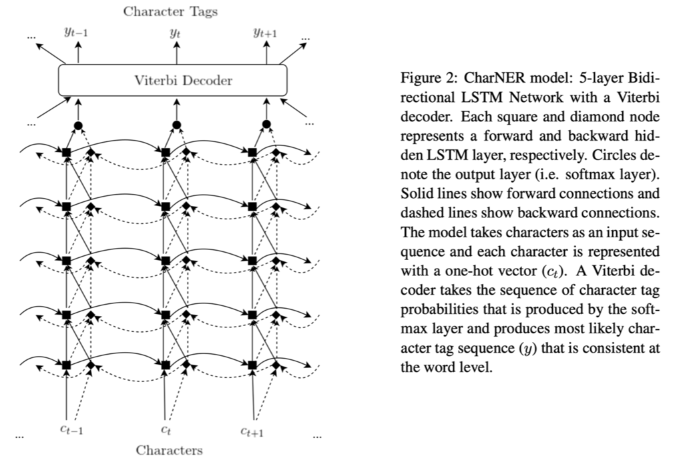

# CharNER: Character-Level Named Entity Recognition
Onur Kuru, Arkan Ozan Can, and Deniz Yuret. Charner: Character-level named entity recognition. In Proceedings of the 26th International Conference on Computational Linguistics, pages 911–921. Osaka, Japan, December 2016


#### [Link to the Paper](https://aclweb.org/anthology/C16-1087)

###Prerequisite
* Keras 2.2.4
* numpy
* sklearn

## Model Architecture


	

## Model

This model represents a sentence as a sequence of characters instead of words.<br>The model consists of stacked bidirectional LSTMs which inputs characters and outputs tag
probabilities for each character. These probabilities are then converted to consistent word level
named entity tags using a Viterbi decoder. The model is  able to achieve close to state-of-the-art NER
performance in seven languages with the same basic model using only labeled NER data and no
hand-engineered features or other external resources like syntactic taggers or Gazetteers.(I have ran the model only for english dataset)
<br>
The model takes characters represented in their one hot encoding format as input , which is feed to the 5 layer Bidirectional LSTM which outputs tag probabilities for each character.
A Viterbi decoder takes the sequence of character tag
probabilities that is produced by the softmax layer and produces most likely character tag sequence (y) that is consistent at
the word level.

##Input/Output Format (Prediction)
*   INPUT (File)
    * File is read by .read_dataset() function
    *Space seperated coloums: <br>
    WORD POS_Tag Chunk True_Label(If present else None) 
    
* OUTPUT (File)
    * Space seperated coloums:<br>
    Word True_Label(If present else None) Predicted_Label

##Input/Output Format (Training)
* INPUT 
    * Sentence as sequence of characters (one hot encodings)
* OUTPUT
    * Tag probabilities (which are then processed to make word level tags)

##Benchmark Datasets
* **CoNLL 2003**
* **OntoNotes 5.0**

## Evaluation Metrics
* Precision
* Recall
* F1
## Results

  | Datasets           | Precision           | Recall              | F1                   |
  |--------------------|:-------------------:|:-------------------:|:--------------------:|
  |CoNLL 2003          |  79.4%              | 81.2%               |80.3%                 |
  |OntoNotes 5.0       |69%                  | 69.8%               |69.3%                 |  


## To Run

1.Import model & make instance of the model from main.py
```python 
from src.main import CharNER

charNerModel = CharNER()
```
2.Call read_dataset() and give all file paths required in form of dictionary (i.e train,dev,test)
```python 
file_Dict = dict()
file_Dict['train'] = inputFile
file_Dict['test'] =inputFile
file_Dict['dev'] = inputFile
data_dict = charNerModel.read_dataset(file_Dict, 'conll3')
```
3.Train Model using .train() , Contains required & optional fields check [notebook](./JupyterNotebook/CharNerModel.ipynb)

```python
charNerModel.train(data_dict,checkpoint_dir="../model")
```

4.Evaluate Model using .evaluate() , Contains model_dir as a required field(For Loading Model)

```python 
ground_truths = self.convert_ground_truth(data_dict)
predicted_values,output_file_path = self.predict(data_dict['test'],
                                              model_dir="../model")
precision,recall,f1 = charNerModel.evaluate(predicted_values, ground_truths)

print("Precision : ",precision)
print("Recall : ",recall)
print("F1 : ",f1)
```

5.Predict using Model using .predict() ,Contains model_dir as a required field (For Loading Model)

```python 
predicted_values,output_file_format = charNerModel.predict(data_dict['test'],model_dir ="./model")
print(predicted_values)
```
6.Save Model using .save_model(). Give path of dir to save model
```python 
charNerModel.save_model(checkpoint_dir="../model")
```
7.Load Model using .load_model() . Give path of dir where the model is saved
```python 
model = charNerModel.load_model("../model")
```


## To Test


## Link to Jutyper Notebook and video
* [CharNerModel.ipynb](./JupyterNotebook/CharNerModel.ipynb)
*
## Reference
* [Nur Lan's Keras Implementation](https://github.com/0xnurl/keras_character_based_ner)
* [Onur Kuru's Char NER Repo (Official Implementation)](https://github.com/ozanarkancan/char-ner)


