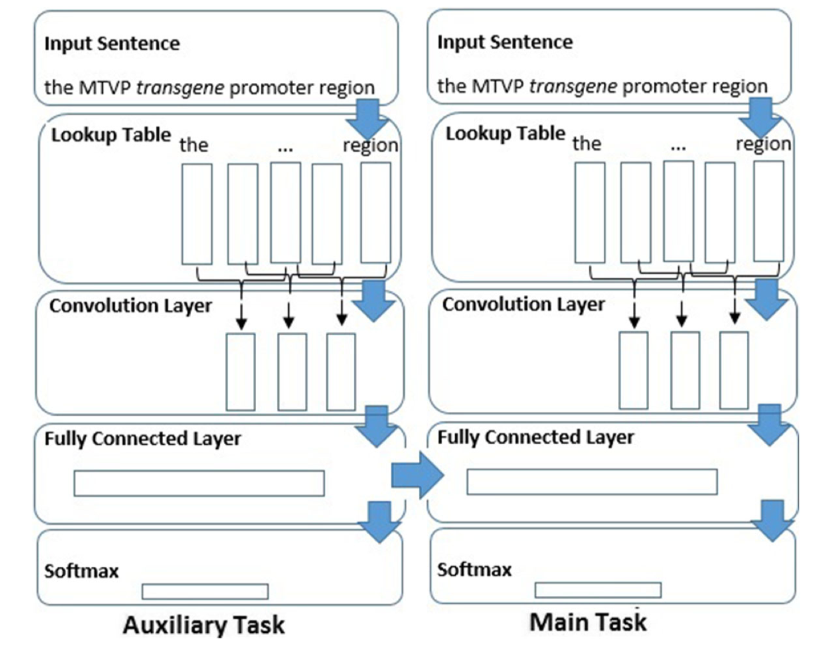

MTL
===================
- A neural network multi-task learning approach to biomedical named entity recognition.
- Crichton, Gamal, et al. A neural network multi-task learning approach to biomedical named entity recognition. BMC bioinformatics 18.1 (2017): 368. [link to original paper](https://bmcbioinformatics.biomedcentral.com/track/pdf/10.1186/s12859-017-1776-8)

## Original Code
[https://github.com/cambridgeltl/MTL-Bioinformatics-2016](https://github.com/cambridgeltl/MTL-Bioinformatics-2016)

## Description
- The paper using Multi-task Learning to predict the biomedical name entity with the following method
- Tokenize word in sentence using pre-trained word embedding
- Train the auxiliary task network using POS tagging corpus
- In main task, input sentences at the same time and concatenate and reshape two output from both fully connected layer.
- To learn a problem together with other related problems at the same time, using a shared representation.
- Network Model
 
 
 
## Input / Output Format

-  Input format: Sentence 
	- `Salivary immunoglobulin was determined on 3 occasions.`
-  Output format: Sentence with name entity 
	-  	`[(Salivary, B-Protein),(immunoglobulin, I-Protein),(was, O), (determined, 0), (on, 0), (3, 0), (occasions, 0)]`
-  pre-trained embedding: download from [https://drive.google.com/open?id=0BzMCqpcgEJgiUWs0ZnU0NlFTam8](https://drive.google.com/open?id=0BzMCqpcgEJgiUWs0ZnU0NlFTam8 ) and put it into folder `./vectorfile/`
    
## Evalution
- Benchmark Datasets
    - CHEMDNER
- Evaluation metrics
    - Precision
    - Recall
    - F-1 score
- Results (Test set)

| Dataset | Precision | Recall | F-1 score | 
| :--- | :---: | :---: | :---: | 
| CHEMDNER | 72.27% | 56.81% | 62.15% | 

## Demo
- [Sample notebook](./demo.ipynb)
- [Demo video](https://youtu.be/oG1qZ_8uGBU)

