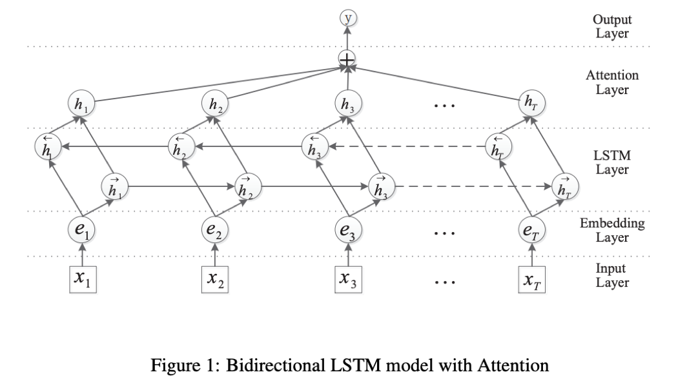
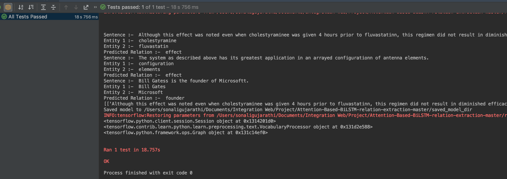

# Attention-Based Bidirectional Long Short-Term Memory Networks for Relation Classification
P. Zhou, W. Shi, J. Tian, Z. Qi, B. Li, H. Hao, and B. Xu, “Attention-Based Bidirectional Long Short-Term Memory Networks for Relation Classification,” Proceedings of the 54th Annual Meeting of the Association for Computational Linguistics (Volume 2: Short Papers), 2016.

#### [Link to the Paper](https://www.aclweb.org/anthology/P16-2034)

### Prerequisite
*   Python 3.7
*   TensorFlow 1.13.1 or lesser
*   numpy 1.16.1
*   pandas 0.24.1
* nltk

## Model Architecture


## Approach


The model uses neural network attention mechanism with Bidirectional Long Short-Term Memory Networks(BiLSTMs) to capture
the most important semantic information in a sentence. The model does not utilize any features derived from lexical resources or NLP systems.It uses word vectors and position indicators as features.
Using attention helps the model to automatically focus on the words that have a decisive effect on the classification. The model has 5 main components: 
* Input Layer : Input sentence to the model
* Embedding Layer : Each word is mapped to a low dimension vector
* LSTM Layer : Use BiLSTM to get high vector features from embedding layer
* Attention Layer : Produces a weight vector, merges word-level features from each time step into 
a sentence-level feature vector, by multiplying the weight vector
* Output Layer : The sentence-level feature vector is used for relation classification with help of a softmax classifier

## Input/Output Format (Prediction)
* INPUT (File)
    * File is read by .read_dataset() function
    * Tab seperated coloums: <br>
    Sentence    Entity1 Entity1Type Entity1StartPosition	Entity1EndPosition	Entity2	Entity2Type	Entity2StartPosition	Entity2EndPosition	RelationType(If Present,else put None)
* OUTPUT (FIle)
    * Tab seperated coloums:<br>
    Sentence Entity1 Entity2 PredictedRelation TrueRelation(If Present else None)
    
## Input (Training)
* Training requirements:- 
    * Train/Test files
    * glove.6B.100d.txt
* gloVe can be found at [https://nlp.stanford.edu/projects/glove/](https://nlp.stanford.edu/projects/glove/) Download glove.6B.zip and use the glove.6B.100.txt from that

## Benchmark Datasets
* **SemEval-2010 Task #8**
* **NYT**
* **DDI 2013**

## Evaluation Metrics
* Precision
* Recall
* F1
## Results


  | Datasets           | Precision           | Recall              | F1                   |
  |--------------------|:-------------------:|:-------------------:|:--------------------:|
  |SemEval-2010 Task 8(Without directions)  |  81.26%             | 85.52%              |83.47%
  |(With directions)   |  79.79%             | 84.27%              | 81.97%
  |NYT                 |70.23%               | 66.94%              |68.55%|  
  |DDI 2013            |82.99%               |90.25%               |86.46%|


## To Run

1.Import model from AttentionBasedModel.py and create instance of the same

```python
from src.AttentionBasedModel import AttentionBasedBiLstmModel
attModel = AttentionBasedBiLstmModel()

```
2.Call read_dataset(input_file_path) on the train file for training the model
```python
input_file_path = "./data/train.txt"
common_format_data = attModel.read_dataset(input_file_path)
```

3.Train Model using .train() , Contains required & optional fields check [notebook]()

```python
attModel.train(common_format_data,embedding_path ="./res/glove.6B.100d.txt")
```

4.Evaluate Model using .evaluate() , Contains checkpoint_dir as a required field (For Loading Model)

```python 
test_common_format_data = attModel.read_dataset(test_file_path)
attModel.evaluate(test_common_format_data,checkpoint_dir = "./runs/models/checkpoints")
```

5.Predict using Model using .predict() ,Contains checkpoint_dir as a required field (For Loading Model)

```python 
predict_data = attModel.read_dataset(predict_data_path)
predictions,output_file_path = attModel.predict(predict_data,checkpoint_dir = "./runs/models/checkpoints")
```
6.Save Model using .save_model(). Give path of dir to save model
```python 
attModel.save_model(dir_path_save)
```
7.Load Model using .load_model() . Give path of dir where the model is saved
```python 
attModel.load_model(saved_model_dir)
```

## To Test


## Link to Jupyter Notebook and Video
* [AttentionBasedModel.ipynb](./JupyterNotebook/AttentionBasedModel.ipynb)
* [Video](https://youtu.be/OY0_Bhx6lcU)

## Reference
* SeoSangwoo's Attention-Based-BiLSTM-relation-extraction repo [[github]](https://github.com/SeoSangwoo/Attention-Based-BiLSTM-relation-extraction)


