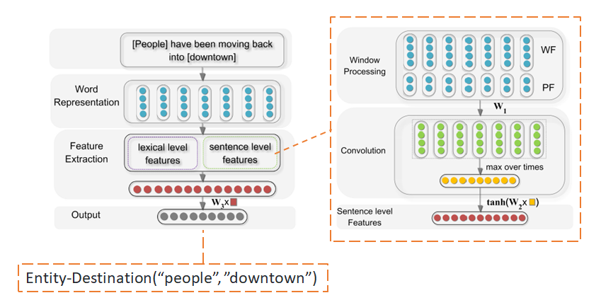

# Relation classification via convolutional deep neural network

### Refactored by Wing Wa Leung (wingwale@usc.edu)

## Title of the paper
[Relation Classification via Convolutional Deep Neural Network](https://www.aclweb.org/anthology/C14-1220)

## Full citation
Daojian Zeng, Kang Liu, Siwei Lai, Guangyou Zhou and Jun Zhao. Relation Classification via Convolutional Deep Neural Network.  The 25th International Conference on Computational Linguistics (COLING), Dublin, Ireland, 2014.

## Overview
* A relation extraction model that uses Convolutional Neural Network (CNN)
* Tensorflow implementation
* Input sentence is first broken down into word tokens, and each word is transformed into a word embeddings vector
* Lexical and sentence level features are extracted and concatenated to form the final feature vector
    * Sentence level features are obtained through a max-pooled CNN
* The final feature vector is fed into a softmax classifier to determine the relation type

## Input/Output format for the model
### Inputs
* Sentence
* Two named entities

### Output
* Relation type

## Benchmark datasets
1. DDI2013
    * 5 relation types
    * Training set: 27792 samples
    * Testing set: 5716 samples

2. SemEval2010 Task8
    * 19 relation types
    * Training set: 8000 samples
    * Testing set: 2717 samples

3. NYT dataset
    * 25 relation types
    * Training set: 235275 samples
    * Testing set: 388 samples

## Evaluation metrics and results
### Evaluation metrics
Marco-averaged
* Precision
* Recall
* F1-score

### Evaluation results

## Link to Jupyter notebook
[Benchmark 1: training](cnn_notebook1_train.ipynb)
[Benchmark 1: evaluation](cnn_notebook1_test.ipynb)

[Benchmark 2: training](cnn_notebook2_train.ipynb)
[Benchmark 2: evaluation](cnn_notebook2_test.ipynb)

[Benchmark 3: training](cnn_notebook3_train.ipynb)
[Benchmark 3: evaluation](cnn_notebook3_test.ipynb)

## [Link to Youtube video](https://youtu.be/4IUzWw3d6To)